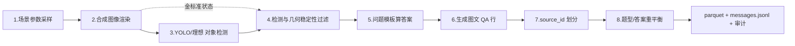

# Synthetic VQA Pipeline

> Zoo-Bus 兼容的**合成视觉问答（VQA）数据集生成管线**：从场景参数采样到均衡训练集的一条龙构建，答案 100% 由几何规则计算，可审计、可复现。

版本 `0.2.0` · Python 3 · 仅依赖 `Pillow / pyarrow / datasets`

---

## 为什么需要它

合成数据最大的风险是**标签不可信**与**评测泄漏**。本管线围绕两条铁律设计：

- **答案只来自「过滤后的检测框」**（`proof.evidence_source == "filtered_detections"`），绝不回看生成器私有坐标——所以 QA 链路对真实检测器同样成立。
- **按源图（`source_id`）划分 train/evaluation/test**，同一张图的所有 QA 行同属一个 split，杜绝跨 split 泄漏。

这样产出的数据集既能训练多模态模型，也能给出**可信的泛化结论**。

---

## 数据流总览

一次构建（`run_reference_pipeline()`）按 **8 个阶段** 串联：



核心数据契约：**源图是最小复用单位**（一图多 QA、共享字节、同 split）；**答案只来自过滤后检测框**。每个阶段的「目标 / 代码 / 输入→输出 / 关键实现 / VQA 作用」详见 [数据流与VQA建构过程.md](数据流与VQA建构过程.md)。

---

## 项目结构

```text
.
├── synthetic_vqa/            # 核心包
│   ├── reference.py          # 8 阶段主逻辑：采样 / 几何过滤 / 29 题模板 / 划分 / 重平衡
│   ├── rendering.py          # 精灵合成渲染（AssetPack + render_reference_scene）
│   ├── adapters.py           # 检测器协议：IdealDetectionReplay / YoloDetector / DetectionReplay
│   ├── pipeline.py           # 编排入口 run_reference_pipeline / run_smoke_pipeline
│   ├── exporters.py          # 导出 parquet / messages.jsonl / evaluation_inputs.jsonl
│   ├── models.py             # 数据模型（Sample / Scene / QAPair …）
│   ├── scene.py / qa.py      # 场景与 QA 辅助
│   ├── validation.py         # 提交前核验（行 ID / split / proof 一致性）
│   ├── selection.py          # 重平衡稳定排序键
│   └── cli.py                # 命令行入口（smoke / build）
├── generate_sprites.py       # 程序化生成 8 类 Kenney 风格精灵 → assets/
├── generate_reference_image.py  # 生成 Zoo-Bus 风格参考图（几何合成）
├── preview_render.py         # 渲染预览：精灵对照表 + 场景预览图 → artifacts/
├── run_repro.py              # 集成验证：16 源场景跑通全链路（→ artifacts/zoo_bus_repro/）
├── tests/test_pipeline.py    # 管线测试
├── assets/                   # 背景图 + 8 类精灵（Kenney CC0 风格，含许可证）
├── artifacts/                # 渲染预览产物（构建产物由 .gitignore 排除）
└── 数据流与VQA建构过程.md    # 详细数据流文档
```

---

## 安装

```bash
git clone https://github.com/693623649-border/synthetic-pipeline.git
cd synthetic-pipeline
python -m venv .venv && source .venv/bin/activate
pip install -r requirements.txt
```

依赖仅三项：`Pillow>=11.3,<12`、`pyarrow>=21,<22`、`datasets>=4.5,<5`。YOLO 检测是**可选**的，需要时再额外安装 Ultralytics 并自行提供权重（本管线绝不自动下载权重）。

---

## 快速开始

### 1) 集成验证（推荐先跑）

用真实精灵跑通完整复现管线，16 个源场景产出 147 行 QA：

```bash
python run_repro.py
# 产物：artifacts/zoo_bus_repro/{images/, dataset.parquet, messages.jsonl, ...}
```

[run_repro.py](run_repro.py) 的数据流：`AssetPack(assets/ 真实精灵) → SceneParameterSampler 随机采样 → render_reference_scene 精灵合成 → IdealDetectionReplay 理想检测 → DetectionGeometryFilter 几何过滤 → ZooBusTemplateGenerator 29 题模板 → source_id 级分割 → 答案/题型平衡 → export_dataset`。

### 2) CLI：smoke（本地冒烟，20 行）

```bash
python -m synthetic_vqa smoke --output artifacts/smoke
```

未提供 `--asset-root` 时使用内存兼容资产，验证 alpha 合成、原生/输出 bbox、编号叠加、JPEG 导出与状态保存。

### 3) CLI：build（完整 Zoo-Bus 兼容构建）

```bash
python -m synthetic_vqa build \
  --output artifacts/reference \
  --num-scenes 120 \
  --per-answer 8 \
  --per-question-type 24 \
  --detector ideal          # ideal | replay | yolo
```

关键参数：

| 参数 | 含义 |
| --- | --- |
| `--num-scenes` | 采样源场景数 |
| `--per-answer` | 每个 (split, 题型, 答案) 桶最多保留的行数；`0` 不限 |
| `--per-question-type` | 每个 (split, 题型) 最多保留的行数 |
| `--strict-balance` | 任一目标桶有缺口时直接失败（而非导出未平衡集） |
| `--detector` | `ideal` 用生成器匹配检测（本地默认）；`replay` 读历史检测 JSONL；`yolo` 跑本地权重 |
| `--asset-root` | 外部 Zoo-Bus 资产目录；缺省回退到仓库 `assets/` |

### 4) 辅助脚本

```bash
python generate_sprites.py       # 生成/补齐 8 类精灵到 assets/
python preview_render.py         # 输出精灵对照表 + 场景预览到 artifacts/
python generate_reference_image.py  # 生成 Zoo-Bus 风格几何参考图
```

---

## 八阶段数据流（精简）

| # | 阶段 | 代码 | 输入 → 输出 |
| --- | --- | --- | --- |
| 1 | 场景参数采样 | `SceneParameterSampler.sample()` | (seed, index) → 一组 `SceneObject`（原生 4032×3024 坐标） |
| 2 | 合成图像渲染 | `render_reference_scene()` | `Scene` → 1280×960 JPEG + 缩放后坐标（保留 `source_bbox` 原生坐标） |
| 3 | YOLO 对象检测 | `IdealDetectionReplay` / `YoloDetector` | `DetectionInput` → 候选检测框（clock 附近用红色连通域恢复朝向红点，不读生成器坐标） |
| 4 | 检测与几何过滤 | `DetectionGeometryFilter.prepare()` | (scene, raw_detections) → `GeometryState`（五步清洗 + 几何安全带） |
| 5 | 问题模板算答案 | `ZooBusTemplateGenerator.generate_all()` | `GeometryState` → 29 题型的 `(Q, A, proof)` |
| 6 | 生成图文 QA | `build_reference_samples()` | `QAPair + SourceScene` → `Sample`（一图多 QA、共享字节） |
| 7 | source_id 划分 | `_split_source_ids()` | 源图打乱 → `{train, evaluation, test}`，默认 80/10/10 |
| 8 | 重平衡 | `rebalance_rows()` | 按 `(split, question_type, answer)` 分桶 + answer round-robin + 稳定 hash 截断 |

> 每一步的「为什么这么做、防止什么歧义」见 [数据流与VQA建构过程.md](数据流与VQA建构过程.md)。

---

## 核心设计原则

1. **证据唯一来源**：答案只用过滤后检测框算，几何安全带保证答案对检测微扰鲁棒（否则「最近长椅」会在 1 像素之差间翻转）。
2. **源图级划分**：同一 `source_id` 的全部 QA 行同属一个 split；6 个组合题型（`HELDOUT_QUESTION_TYPES`）从 train 移除、仅留 evaluation/test，专测组合泛化。
3. **训练视图极简**：`messages.jsonl` 只含 `{id, source_id, split, messages}`；`evaluation_inputs.jsonl` 连 `answer` 都去掉；`proof` 只进 parquet、不进 messages，防止规则证据泄漏。
4. **不伪造**：候选不足时**不复制、不造样本**，缺口写进 `balance.shortfalls`；`--strict-balance` 下有缺口即失败。
5. **可复现**：每源图独立 RNG（采样与过滤顺序无关），重平衡用 `sha256(seed ∥ source_id ∥ question_type ∥ answer)` 稳定排序。

---

## 构建产物

一次完整构建输出到 `--output` 目录：

| 产物 | 内容 | 用途 |
| --- | --- | --- |
| `images/<source_id>` | 每源图只写一次的 1280×960 JPEG | 所有 QA 行共享 |
| `dataset.parquet` | 内嵌图 + 金标准 annotations + 过滤后 detections + QA + scene state + proof | 训练 / 审计 |
| `messages.jsonl` | image ref + question + answer | 多模态 SFT 训练 |
| `evaluation_inputs.jsonl` | evaluation/test 的图 + 问题（**无答案**） | 公开盲测 |
| `construction_audit.json` | 采样 / 过滤 / 模板拒绝 / split / 重平衡全记录 | 审计 |
| `summary.json` | 29 题清单、源图数、分布、filter/balance 摘要、artifact 路径、SHA-256 | 概览 |

> `dataset.parquet` 体积较大且可由管线再生，已由 `.gitignore` 排除，不入库。

提交前 [`validate_reference_rows()`](synthetic_vqa/validation.py) 会断言：行 ID 全局唯一、一个 source 只属一个 split、train 无 heldout 题型、同 source 同题型无重复、`proof.evidence_source == "filtered_detections"` 且**用导出的 detections 能重算出完全一致的 (Q, A, proof)**。

---

## 测试

```bash
python -m pytest tests/ -v
```

---

## 资产与许可

- `assets/` 中的精灵与背景为程序化生成的 **Kenney Animal Pack (CC0) outline 风格**素材，许可证见 [assets/KENNEY_LICENSE.txt](assets/KENNEY_LICENSE.txt)。
- 仓库**不内置**参考数据集的私有像素资产；未提供外部 `--asset-root` 时，`smoke` 模式使用内存兼容资产做几何/导出验证，不声称与参考数据集逐像素一致。

---

## 文档

- 📄 [数据流与VQA建构过程.md](数据流与VQA建构过程.md) — 八阶段逐段详解 + 关键代码索引
