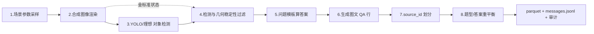

# Zoo-Bus 兼容 VQA 数据集——数据流与建构过程

本文按以下 **8 个阶段** 逐段说明本代码库（`synthetic_vqa`）的实现：每段给出「阶段目标 / 对应代码 / 输入→输出数据流 / 关键实现 / 在 VQA 建构中的作用」。

```
场景参数采样 → 合成图像渲染 → YOLO 对象检测 → 检测与几何稳定性过滤
→ 根据问题模板计算答案 → 生成图文 QA → 按 source_id 划分数据 → 题型及答案分布重平衡
```

## 0. 总览

整条链路实现在 [`synthetic_vqa/reference.py`](synthetic_vqa/reference.py)，编排入口是 [`synthetic_vqa/pipeline.py`](synthetic_vqa/pipeline.py) 的 `run_reference_pipeline()`。一次构建的数据流主线如下：



核心数据契约贯穿全程：

- **源图（source）** 是最小复用单位，一张图由 `source_id`（如 `zoo_bus_0000002a_00007.jpg`）唯一标识；
- **QA 行（row）** 挂在源图上，同一 `source_id` 的所有 QA 行共享同一张图、同一个 split；
- **答案只来自过滤后的检测框**（`proof.evidence_source == "filtered_detections"`），绝不回看生成器私有坐标。

---

## 1. 场景参数采样

**目标**：为每个 `source_id` 采样一组确定、可复现、无重叠的场景参数（放什么、放几个、放哪里、时钟朝哪）。

**代码**：[`SceneParameterSampler`](synthetic_vqa/reference.py#L233)，入口 [`sample(index)`](synthetic_vqa/reference.py#L308)。

**数据流**：

```
(seed, index) ──► 独立 RNG ──► 一组 SceneObject(原生 4032×3024 坐标)
                              ──► SourceScene(source_id, scene, annotations, seed)
```

**关键实现**：

- **每个源图一个独立 RNG**：`rng = random.Random((self.seed << 20) + index)`，使采样结果与过滤顺序无关，同一 index 永远复现同一张图。
- **编号锚点先放、再按横坐标编号**：长椅 3–5 个、停止标志 2–4 个。`_place_numbered_anchor()` 把第 i 个锚点的横坐标按比例均匀铺开（`fraction = 0.04 + 0.92 * i/(total-1)`），保证图上「从左到右的 1,2,3」编号稳定可读；随后 `sorted(..., key=center_x)` 写入 `number`。这是后续 QA 能引用「bench 2」「stop sign 1」的视觉基础。
- **关联物围绕 anchor 放置**：每个长椅配 0–3 个 person、每个停止标志配 0–3 只动物（zebra/elephant/giraffe 随机），用 `_place_associated()` 在 anchor 周围 300–470 像素环带采样，并记录 `anchor_uid`。关系在采样时即为真，而非事后伪造。
- **时钟与朝向**：`heading_mode = index % 4` 选定朝向目标（最近长椅 / 最近停止标志 / 随机长椅 / 随机停止标志），朝向单位向量由 `clock→target` 算得并归一化，编码进红点方向；另有 `arrival_mode` 每 4 张刻意制造一张「时钟贴近长椅/动物」的到达正例。
- **碰撞与边界**：`_free()` 要求每个 bbox 完全在画布内且与已占区域留有 margin；`_clock_render_safe()` 额外为旋转后的时钟和 215px 红点留安全余量；单张采样最多重启 30 次。

**采样产物**写入 `scene.metadata["sampled_parameters"]`（对象计数、anchor 数、朝向角度、朝向目标、arrival 模式、重启号），供审计与复现。

**VQA 作用**：这一步决定了「图里有什么」和「问题能问什么」。采样时就把「红点对准某个已编号锚点」坐实，使避障/转向题的 `heading dot aligned` 前提与图像一致，而不是事后再去拼凑。

---

## 2. 合成图像渲染

**目标**：把原生坐标的场景状态，按 Zoo-Bus 的精灵合成约定渲染成 JPEG。**（但目前要什么样的图片不清楚，待后续确认再下载真实assert）**

**代码**：[`render_reference_scene()`](synthetic_vqa/rendering.py#L164)，资产加载 [`AssetPack.from_root()`](synthetic_vqa/rendering.py#L112)。

**数据流**：

```
Scene(4032×3024 原生坐标)
  ──► alpha_composite(background + sprites) ──► 旋转clock + 画红点
  ──► 缩放最长边→1280 ──► 叠加编号 ──► JPEG q95
  ──► (image_bytes, output_scene[1280×960 坐标])
```

**关键实现**：

- **真实资产 vs 兼容资产**：`AssetPack.from_root(assets/)` 检查 8 个文件（`background.jpeg`/`bench.png`/`person.png`/`stopSign.png`/`zebra.png`/`elephant.png`/`giraffe.png`/`clock.png`）齐全则 `is_reference=True` 走真实精灵合成；否则退回 `_compatibility_assets()` 色块，并在 metadata 标 `reference_assets: false`。
- **按 z_index 合成**：背景 → 动物(25) → 长椅/停止标志(20) → person(30) → 时钟(50) → 编号/红点，用 `native.alpha_composite(sprite, (x,y))` 逐层粘贴透明 PNG。
- **时钟旋转**：`angle = degrees(atan2(-hx, -hy))`，`sprite.rotate(angle, expand=True)`，旋转后重新按中心对齐 bbox。
- **红色朝向点**：在时钟中心前方 215 原生像素处画半径 45 的圆 `(220,30,30)`，方向由 `scene.heading` 单位向量决定；这一步把「朝向」从抽象向量变成图上可见像素。
- **缩放与编号**：`scale = 1280 / max(native.size)` 缩到 1280×960；编号在缩放**之后**叠加（避免缩放致文字模糊），用 `anchor="mm"` 居中绘制。
- **坐标双轨**：输出 `Scene` 的 `bbox` 是 1280×960 坐标，`source_bbox` 保留 4032×3024 原生坐标，使每行既能直接训练/评估又能追溯原始放置。

**VQA 作用**：把结构化世界状态变成多模态模型实际看到的像素。旋转时钟 + 红点把「朝向」可视化，使 heading/turn/relative-heading 类问题有唯一的视觉答案依据。

**注意**： 合成图像渲染需要根据后续需求修改
--


## 3. YOLO 对象检测

**目标**：给每张图产出「检测器视角」的候选框，作为后续 QA 的唯一证据来源（不使用生成器坐标算答案）。

**代码**：[`synthetic_vqa/adapters.py`](synthetic_vqa/adapters.py) 的 [`Detector` 协议](synthetic_vqa/adapters.py#L31)，三种实现：

| 检测器 | 类 | 行为 |
| --- | --- | --- |
| 理想检测回放（默认） | [`IdealDetectionReplay`](synthetic_vqa/adapters.py#L61) | 用渲染状态（`annotations`）作为置信度 1.0 的检测结果，打通后续阶段，无需权重 |
| 真实 YOLO（开发机） | [`YoloDetector`](synthetic_vqa/adapters.py#L74) | 接 Ultralytics，加载 COCO 权重推理；本环境不下载权重，未配置时抛 `AdapterUnavailableError` |
| 检测回放 | replay 适配器 | 逐行绑定 JPEG 的 `sha256 + size` 与 `source_id` 集合，避免旧 YOLO 结果错配新图 |

**数据流**：

```
DetectionInput(image_bytes, source_id) ──► Detector.detect() ──►
List[{area, bbox[xywh], category, category_id, iscrowd, score}]
```

**关键实现**：

- 标准的 7 个可检测类（clock/bench/person/stop sign/zebra/elephant/giraffe）都在 COCO 中，`YoloDetector.detect()` 把预测类映射为项目类名、把 `xyxy` 统一为 `xywh`、补 `area/category_id/iscrowd/score`。
- **heading marker 不在 COCO 中**：[`YoloDetector._detect_heading_marker()`](synthetic_vqa/adapters.py#L176) 在检测到 clock 后，只读取 JPEG 像素，在 clock 附近窗口用「红色连通域」恢复圆形红点，输出为普通 `heading marker` detection 进入同一过滤器——**它不读生成器坐标**，因此 QA 链路对真实 YOLO 与理想检测都成立。
- 默认 `IdealDetectionReplay` 在 [`build_reference_samples()`](synthetic_vqa/reference.py#L1067) 内注入，`summary.adapters.detector = "ideal-detection-replay"`。

**VQA 作用**： detect方面，项目在后续开发机中要实现的是**Oracle 真值+YOLO 可见性验证+几何稳定性检查→最终 QA**
目前本地实现的是**Oracle 真值 → 几何稳定性检查 → 最终 QA**

---

## 4. 检测与几何稳定性过滤

**目标**：清洗检测输出、绑定稳定身份，并拒绝任何会让答案在检测微扰下翻转的几何情形。

**代码**：[`DetectionGeometryFilter.prepare()`](synthetic_vqa/reference.py#L448)，产出 `GeometryState`。

**数据流**：

```
(scene, raw_detections) ──► 五步清洗 ──► GeometryState
                                    {observations, retained_detections, report}
```

**五步清洗**（顺序即数据流）：

1. **合法性门限**：schema 正确、`xywh` 有限、`0≤score≤1`、类别在支持集、bbox 在图内；否则计入 `malformed/non_finite/invalid_score/unsupported_category/out_of_bounds/low_confidence`。
2. **类内 NMS**：同类候选按 score 降序，IoU ≥ 0.75 的判为重复（`duplicate_nms`）。
3. **身份门限**：剩余检测与渲染状态同类真实对象做一对一匹配，要求 IoU ≥ 0.30（`identity_iou`）。**这一步只决定「检测是否可用」，绝不把真实对象的 uid/编号/几何灌回 QA**——匹配完即丢弃源对象引用。
4. **编号稳定性**：bench/stop sign 这类编号锚点，按**检测框横坐标**排序赋号，且要求：
   - 无漏检（`incomplete_visible_number_set`）；
   - 检测顺序与可见编号不交叉（`crossed_visible_number_order`）；
   - 相邻横向中心距 ≥ 1.25 × 较宽框（`unstable_visible_number_order`）。
   任一不满足则**整类拒绝**——绝不把图上的「2」重命名为「1」。
5. **几何安全带**（在每道题计算时再校验，见下表）：

| 规则 | 拒绝条件 | 防止的歧义 |
| --- | --- | --- |
| 最近 / 排序 | 相邻距离差 < 对角线 × 3.5% | 最近目标随检测微扰翻转 |
| 人/动物归属 | 最近-次近 anchor 距离差 < 对角线 × 2.5% | 「在某长椅/标志周围」归属不清 |
| 八向方向 | 距 45° 扇区边界 < 6° | East/Northeast 等标签不稳定 |
| 到达 | 表面间距落在阈值安全带内 | Yes/No 被小框偏差翻转 |
| 避障 | 线段-障碍 clearance 接近 0 或障碍正前方 | straight/left/right 无唯一解 |
| 转向 | 目标几乎在正后方 | 左/右转无唯一解 |

所有拒绝原因按 `source_id` 写进 `construction_audit.json`。**某题型在一张图上不稳定，只丢这道 QA，不影响同图其他稳定题**。

**VQA 作用**：答案只从这里产出的 `observations`（过滤后检测框）计算，几何安全带保证答案对检测框的微小抖动鲁棒——否则同一个「最近长椅」会在 1 像素之差间翻转，标签不可信。

---

## 5. 根据问题模板计算答案

**目标**：对每个稳定场景，跑完 29 个公开问题模板，用过滤后检测框算出确定性答案与结构化证明。

**代码**：[`ZooBusTemplateGenerator.generate_all()`](synthetic_vqa/reference.py#L721)，29 题清单见 [`QUESTION_TYPES`](synthetic_vqa/reference.py#L26)。

**数据流**：

```
GeometryState ──► 29 个模板各 try/except ──► (List[QAPair], rejected{题型:原因})
QAPair = (question_type, question, answer, proof{evidence_source:"filtered_detections", ...})
```

**29 题型分组**（每组共用一个几何原语）：

| 组 | 代表题型 | 计算原语 |
| --- | --- | --- |
| 计数 | CountPeople / CountAnimals / CountPeopleAtBench / CountAnimalsAtStopSign | `len(过滤后某类)`，归属用 `_associations` 最近 anchor |
| 列表 | ListBenchesWithAtLeastKPeople / ListStopSignsWithAtLeastKAnimals | anchor 计数 ≥ k 的编号集合 |
| 到达 | ArrivedAtBench / ArrivedAtAnimalsAroundStopSigns | 表面间距 vs `max(clock边长)*0.22` 阈值 |
| 最近/排序 | ClosestBench / ClosestStopSign / PairwiseCloser* / ClosestToFurthest* | `argmin d(clock,target)` + margin 校验 |
| 几何方向 | GeometricDirectionToBench/StopSign | `atan2(-dy,dx)` 量化到 8 扇区 |
| 朝向 | BusHeadingDirection | 红点向量 `atan2(-vy,vx)` 量化到 8 扇区 |
| 转向/相对 | TurnDirectionTo* / *RelativeToHeading | heading 与 target 向量的叉积/夹角 |
| 避障 | AvoidObstacleToReach* / AvoidObstacleToReachClosest* | 障碍到 `clock→target` 线段距离 + 屏幕叉积定左右 |

**关键计算**（避障为例，体现「只用检测框 + 屏幕几何」）：

```
# 障碍中心 p 到 clock(a)→target(b) 线段的最短距离
t = clip( ((p-a)·(b-a)) / ‖b-a‖² , 0, 1 )
q = a + t·(b-a)              # 线段上最近投影点
d_path = ‖p - q‖
r = max(障碍box宽, 高) / 2    # 近似阻挡半径
if d_path > r:  return "keep straight"
# 屏幕坐标叉积判定障碍在行进方向哪一侧
z = (b.x-a.x)(p.y-a.y) - (b.y-a.y)(p.x-a.x)
return "turn left" if z > 0 else "turn right"
# |z| 过小 → 障碍正前方，左右绕行不唯一 → GeometryRejected
```

每个 `proof` 都带 `evidence_source: "filtered_detections"` 并保存距离/阈值/排名/叉积等依据，可供训练前审计；`proof_json` 进 parquet，但**不进 messages.jsonl**（防泄漏）。

**VQA 作用**：答案是根据图片元数据数学规则算出来的，保证 100% 正确。29 题覆盖计数/空间/方向/朝向/避障五大能力，6 个组合题型（`HELDOUT_QUESTION_TYPES`）专门留给 evaluation/test，测组合泛化。

---

## 6. 生成图文 QA

**目标**：把 `QAPair` 与源图绑成可训练/评估的 `Sample` 行，并控制训练视图的泄漏面。

**代码**：[`build_reference_samples()`](synthetic_vqa/reference.py#L1067) 内的组装循环（1121–1147 行），导出 [`messages_record()`](synthetic_vqa/exporters.py#L90)。

**数据流**：

```
QAPair + SourceScene ──► Sample(
  id, image_bytes,            # 同一源图字节
  annotations,                # 金标准（生成器对象）
  detections,                 # 过滤后检测（retained_detections）
  question, answer, question_type,
  source_id, split, capability,
  scene,                      # 含 source_bbox 的完整渲染状态
  difficulty_axes, proof, seed)
```

**关键实现**：

- **一图多 QA、共享字节**：同一 `source_id` 下每个通过过滤的题型生成一条 `Sample`，它们的 `image_bytes` 完全相同（导出时每图只写一次 JPEG）。
- **金标准与检测分离**：`annotations` 是生成器金标准，`detections` 是过滤后检测——两套数据不混用，分别回答「放了什么」与「检出什么」。
- **训练视图极简**：`messages.jsonl` 每行只有 `{id, source_id, split, messages:[{user:[image, question]}, {assistant:[answer]}]}`，**不含** bo3/proof/scene/annotations/detections。评估盲测输入 `evaluation_inputs.jsonl` 连 `answer` 都去掉，只有图 + 问题。

**VQA 作用**：这一步把「几何答案」转成多模态对话训练格式，同时从接口层切断规则证据/金标准向训练模型的泄漏。

---

## 7. 按 source_id 划分数据

**目标**：在源图级别（而非 QA 行级别）做 train/evaluation/test 切分，杜绝同一张图跨 split 造成的数据泄漏。

**代码**：[`_split_source_ids()`](synthetic_vqa/reference.py#L892)，heldout 移除在 [`build_reference_samples()`](synthetic_vqa/reference.py#L1149)。

**数据流**：

```
所有 source_id ──(seed 42 打乱)──► {source_id: "train"|"evaluation"|"test"}
                                   默认 80 / 10 / 10
同一 source_id 的全部 QA 行 ──► 同一个 split
```

**关键实现**：

- **打乱源图而非 QA 行**：`rng = random.Random(config.seed)` 打乱 `sorted(source_ids)`，按比例切分。同一源图的所有 QA 行沿用同一 split，`validate_reference_rows()` 会断言「一个 source 只属于一个 split」。
- **小构建保护**：`total ≥ 3` 时强制 `train≥1, evaluation≥1, test≥1`，使诊断构建也能产出非空评估集。
- **组合题型 heldout**：以下 6 个组合题型从 train 删除（仍保留在 evaluation/test），用于测组合泛化：

```
CountPersonAtClosestBench          ClosestBenchWithPerson
AvoidObstacleToReachClosestBench   AvoidObstacleToReachClosestStopSign
DirectionToClosestBench            DirectionToClosestStopSign
```

**VQA 作用**：源图级切分是「泛化结论可信」的底线——否则同一场景的不同 QA 分到 train 和 test，模型只需记住场景而非学会能力。

---

## 8. 题型及答案分布重平衡

**目标**：在切分之上，按 `(split, question_type, answer)` 三元组控制每个桶的样本量，避免某一答案/某一题型主导数据集。

**代码**：[`rebalance_rows()`](synthetic_vqa/reference.py#L922)，校验 [`validate_reference_rows()`](synthetic_vqa/reference.py#L1008)。

**数据流**：

```
candidates(已 heldout 移除)
  ──► 按 (split, question_type, answer) 分桶
  ──► 桶内稳定 hash 排序 + 截断 per_answer
  ──► answer round-robin 填到 per_question_type
  ──► 同图同题型最多一条 + max_rows_per_source
  ──► selected + BalanceReport{shortfalls, before/after 分布}
```

**关键实现**：

- **稳定排序键**：`_stable_key = sha256(seed ∥ source_id ∥ question_type ∥ answer)`，使「同一个桶里保留哪些」与运行环境无关、可复现。
- **answer round-robin**：填 `per_question_type` 上限时，轮流从各 answer 子桶取，避免某个高频答案独占整个题型配额；同图（`source_id`）同题型最多保留一条，防止一图多题集中。
- **不复制补样本**：候选不足时**不复制、不造样本**，而是把缺口写进 `balance.shortfalls`。`--strict-balance` 下任一非 heldout 的 `split × question_type` 目标或可见答案桶有缺口，构建立即失败——绝不把「未平衡」误标为「完成数据集」。
- **全量证据**：`balance` 报告 `per_split_question_type_before/after` 与 `answers_before/after`，分布变化完全可审计。

**VQA 作用**：保证训练时各类问题、各答案取值都有足够且均衡的覆盖，避免模型因分布倾斜而走捷径

---

## 9. 最终产物与提交前核验

一次完整构建（[`run_reference_pipeline()`](synthetic_vqa/pipeline.py#L63)）输出：

| 产物 | 内容 | 可见性 |
| --- | --- | --- |
| `images/<source_id>` | 每源图只写一次的 1280×960 JPEG | 所有 QA 行共享 |
| `dataset.parquet` | 内嵌图 + 金标准 annotations + 过滤后 detections + QA + scene state + proof + backend provenance | 受限训练/审计件 |
| `messages.jsonl` | 仅 image ref + question + answer | 多模态 SFT 训练 |
| `evaluation_inputs.jsonl` | evaluation/test 的图 + 问题（无答案） | 公开盲测输入 |
| `construction_audit.json` | 采样/过滤/模板拒绝/split/重平衡全记录 | 审计 |
| `summary.json` | 29 题清单、源图数、分布、filter/balance 摘要、artifact 路径、SHA-256 | 概览 |

提交前 [`validate_reference_rows()`](synthetic_vqa/reference.py#L1008) 断言：

- 行 ID 全局唯一、一个 source 只属一个 split、train 无 heldout 题型；
- 同 source 同题型无重复、同 source 图片字节一致、所有输出 bbox 在图内；
- `proof.evidence_source == "filtered_detections"`，且**用导出的 detections 能重算出完全一致的 (question, answer, proof)**——防止 stale 标签仅因 proof 声称「来自检测」就通过；
- 无伪造 BO3 / 模型得分（完整构建 `bo3 = null`，`evaluation_kind = "not_scored"`）。

---

## 10. 关键代码索引

| 阶段 | 文件 | 位置 |
| --- | --- | --- |
| 1 场景参数采样 | [`reference.py`](synthetic_vqa/reference.py) | [`SceneParameterSampler`](synthetic_vqa/reference.py#L233) / [`sample()`](synthetic_vqa/reference.py#L308) |
| 2 合成图像渲染 | [`rendering.py`](synthetic_vqa/rendering.py) | [`render_reference_scene()`](synthetic_vqa/rendering.py#L164) / [`AssetPack`](synthetic_vqa/rendering.py#L103) |
| 3 YOLO 对象检测 | [`adapters.py`](synthetic_vqa/adapters.py) | [`IdealDetectionReplay`](synthetic_vqa/adapters.py#L61) / [`YoloDetector`](synthetic_vqa/adapters.py#L74) |
| 4 检测与几何过滤 | [`reference.py`](synthetic_vqa/reference.py) | [`DetectionGeometryFilter`](synthetic_vqa/reference.py#L441) / [`prepare()`](synthetic_vqa/reference.py#L448) |
| 5 问题模板算答案 | [`reference.py`](synthetic_vqa/reference.py) | [`ZooBusTemplateGenerator`](synthetic_vqa/reference.py#L567) / [`generate_all()`](synthetic_vqa/reference.py#L721) |
| 6 生成图文 QA | [`reference.py`](synthetic_vqa/reference.py) + [`exporters.py`](synthetic_vqa/exporters.py) | [`build_reference_samples()`](synthetic_vqa/reference.py#L1067) / [`messages_record()`](synthetic_vqa/exporters.py#L90) |
| 7 source_id 划分 | [`reference.py`](synthetic_vqa/reference.py) | [`_split_source_ids()`](synthetic_vqa/reference.py#L892) |
| 8 重平衡 | [`reference.py`](synthetic_vqa/reference.py) | [`rebalance_rows()`](synthetic_vqa/reference.py#L922) |
| 编排 + 导出 | [`pipeline.py`](synthetic_vqa/pipeline.py) + [`exporters.py`](synthetic_vqa/exporters.py) | [`run_reference_pipeline()`](synthetic_vqa/pipeline.py#L63) / [`export_dataset()`](synthetic_vqa/exporters.py#L127) |

## 11.目前数据样例
artifacts/zoo_bus_repro/        # 16 源场景 → 147 行 QA
├── images/                 16 张源图（1280×960 JPEG，共 5.5MB）
├── dataset.parquet         41MB  · 147 行 × 22 列（完整训练/审计表）
├── messages.jsonl          52KB  · 147 行多模态训练对话
├── evaluation_inputs.jsonl 20KB  · 62 行盲测输入（无答案）
├── construction_audit.json 68KB  · 逐图构建审计
└── summary.json            36KB  · 概览


